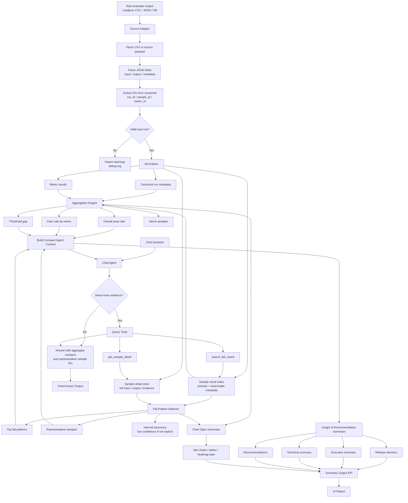

# 8.5 Agent Evaluation Summarizer - Input, Output, Workflow

## 1. Input

Module 8.5 nhận input theo 3 lớp:

1. Raw evaluator output: dữ liệu gốc từ evaluator, hiện tại là Langfuse CSV.
2. Normalized persisted data: dữ liệu đã được adapter/normalizer convert sang schema chuẩn và lưu lại để query.
3. Agent context input: dữ liệu compact được đưa vào LLM/agent để sinh report hoặc trả lời chat.

MVP nên dùng normalized persisted data làm contract chính giữa evaluator output và summarizer. Không đưa toàn bộ sample của run vào LLM context.

### 1.1 Raw Input: Langfuse CSV

Format hiện tại từ evaluator là CSV export từ Langfuse. Các cột cần dùng:

| Column | Required | Description |
|---|---|---|
| `id` | Yes | Raw observation id, dùng làm trace/evidence id. |
| `timestamp` | Yes | Thời điểm evaluator chạy sample. |
| `name` | Yes | Chỉ lấy row `dynamic_metric_evaluation:evaluate_sample`. |
| `sessionId` | Yes | Chứa `run_id`, `sample_id`, `metric_id`. |
| `input` | Yes | JSON string chứa sample input, actual answer, expected output, context. |
| `output` | Yes | JSON string chứa score và reasoning từ evaluator. |
| `metadata` | Yes | JSON string chứa metric name, threshold, evaluator model/provider. |
| `tags` | No | Metadata phụ để filter/debug. |
| `environment` | No | Môi trường chạy evaluator. |
| `comments` | No | Comment từ Langfuse nếu có. |

`sessionId` cần match pattern:

```text
dataset_dm_run:{run_id}:sample:{sample_id}:metric:{metric_id}
```

Rows không match pattern này hoặc không parse được JSON trong `input`, `output`, `metadata` sẽ không đưa vào aggregate chính. Các rows này chỉ lưu vào import warning/debug log.

### 1.2 Normalized Persisted Input Contract

Sau bước convert, system lưu một object chuẩn. Object này có thể chứa toàn bộ samples của run, nhưng đây là persisted/query data, không phải prompt payload đưa trực tiếp vào agent.

```json
{
  "run": {
    "run_id": "142f5b73-3333-45e4-9237-24a33d2595f4",
    "run_name": "Langfuse run 142f5b73-3333-45e4-9237-24a33d2595f4",
    "run_type": "langfuse_dataset_run",
    "product": null,
    "agent_version": null,
    "model_version": null,
    "prompt_version": null,
    "dataset": {
      "dataset_id": null,
      "dataset_name": null,
      "dataset_version": null,
      "sample_count": 53
    },
    "started_at": "2026-05-26T07:24:59.189Z",
    "completed_at": "2026-05-26T07:33:02.425Z",
    "baseline_run_id": null,
    "release_criteria": [
      {
        "metric_name": "Plain Clarity",
        "operator": ">=",
        "threshold": 0.9
      }
    ],
    "import_source": "langfuse_csv"
  },
  "metric_results": [
    {
      "metric_name": "Plain Clarity",
      "metric_group": "communication_quality",
      "score": 0.0465,
      "pass_count": 0,
      "fail_count": 53,
      "total_count": 53,
      "threshold": 0.9,
      "status": "FAIL",
      "severity": "high",
      "description": null
    }
  ],
  "sample_result_index": [
    {
      "sample_id": "79be0842-f1a2-4d5b-8402-8f2fadef3f7b",
      "trace_id": "02ca21aaf4e53ab43ec0d4c63baa3088",
      "input_preview": "Tại sao trẻ cần tiêm vắc xin 6 trong 1 ngay từ khi mới sinh?",
      "actual_output_preview": "Error calling AI Health API: 401 Client Error: Unauthorized...",
      "metric_results": [
        {
          "metric_name": "Plain Clarity",
          "score": 0.0,
          "status": "FAIL",
          "threshold": 0.9,
          "reason": "Kết quả bị đánh giá khó hiểu và không đạt vì câu trả lời chỉ là thông báo lỗi 401 Unauthorized...",
          "error_taxonomy": "runtime_or_api_error",
          "taxonomy_confidence": "inferred_low"
        }
      ],
      "metadata": {
        "metric_id": "551d08d4-cebc-4ff7-9d41-bb7bca917794",
        "evaluator_model": "gpt-5.2",
        "environment": "default",
        "skill_name": null,
        "severity": "high"
      }
    }
  ],
  "sample_detail_store": {
    "storage": "db_or_object_store",
    "query_tools": [
      "search_fail_cases",
      "get_sample_detail"
    ],
    "contains_full_fields": [
      "input.user_input",
      "actual_output.answer",
      "expected_output.answer",
      "metadata.context",
      "metadata.conversation",
      "metric_results.reason",
      "metric_results.evidence"
    ]
  },
  "representative_samples": [
    {
      "sample_id": "79be0842-f1a2-4d5b-8402-8f2fadef3f7b",
      "trace_id": "02ca21aaf4e53ab43ec0d4c63baa3088",
      "metric_name": "Plain Clarity",
      "score": 0.0,
      "reason": "Kết quả bị đánh giá khó hiểu vì câu trả lời chỉ là lỗi 401 Unauthorized.",
      "input_preview": "Tại sao trẻ cần tiêm vắc xin 6 trong 1 ngay từ khi mới sinh?",
      "actual_output_preview": "Error calling AI Health API: 401 Client Error: Unauthorized..."
    }
  ],
  "import_warnings": [
    "Missing product/agent/prompt/dataset metadata in CSV.",
    "Missing explicit skill_name and error_taxonomy; taxonomy may be inferred with low confidence.",
    "Rows without dataset_dm_run sessionId or parsed JSON are excluded from aggregate."
  ]
}
```

### 1.3 Agent Context Input Contract

Agent/report generator chỉ nhận compact context. Full sample detail phải được lấy on-demand qua query tools.

```json
{
  "run": {},
  "metric_results": [],
  "top_fail_patterns": [],
  "representative_samples": [],
  "available_tools": [
    "get_run_overview",
    "get_metric_breakdown",
    "search_fail_cases",
    "get_sample_detail"
  ],
  "context_policy": {
    "do_not_inline_all_samples": true,
    "max_representative_samples_per_pattern": 3,
    "fetch_sample_detail_on_demand": true
  }
}
```

Rule quan trọng:

- `sample_result_index` có thể lưu toàn bộ samples để filter/search/drill-down.
- `representative_samples` chỉ chứa một số case tiêu biểu để agent có evidence ban đầu.
- Agent không được nhận toàn bộ `sample_detail_store` trong prompt.
- Khi user hỏi sâu, agent gọi `search_fail_cases()` hoặc `get_sample_detail(sample_id)`.

### 1.4 Mapping từ Langfuse CSV sang Normalized Input

| Normalized field | Source |
|---|---|
| `run.run_id` | `sessionId.dataset_dm_run:{run_id}` |
| `run.started_at`, `run.completed_at` | Min/max `timestamp` theo `run_id` |
| `run.release_criteria[].metric_name` | `metadata.metric_name` |
| `run.release_criteria[].threshold` | `metadata.threshold` |
| `metric_results[].metric_name` | `metadata.metric_name` |
| `metric_results[].score` | Average `output.score` theo metric |
| `metric_results[].pass_count` | Count rows có `output.score >= metadata.threshold` |
| `metric_results[].fail_count` | Count rows có `output.score < metadata.threshold` |
| `sample_result_index[].sample_id` | `sessionId.sample:{sample_id}` |
| `sample_result_index[].trace_id` | CSV `id` |
| `sample_result_index[].input_preview` | Truncated `input.sample.user_query` |
| `sample_result_index[].actual_output_preview` | Truncated `input.sample.assistant_answer` |
| `sample_detail_store.input.user_input` | Full `input.sample.user_query` |
| `sample_detail_store.actual_output.answer` | Full `input.sample.assistant_answer` |
| `sample_detail_store.expected_output.answer` | Full `input.sample.expected_output` |
| `sample_detail_store.metadata.context` | Full `input.sample.context` |
| `sample_result_index[].metric_results[].score` | `output.score` |
| `sample_result_index[].metric_results[].reason` | Shortened `output.overview_reasoning` |
| `sample_detail_store.metric_results[].evidence` | Full `output.detail_reasoning` |
| `sample_result_index[].metric_results[].error_taxonomy` | Explicit field nếu có; nếu không thì infer low-confidence |

### 1.5 Input Scope: MVP vs Later

| Area | MVP | Later development |
|---|---|---|
| Raw adapter | Chỉ cần `LangfuseCsvAdapter` cho format file hiện tại. | Thêm `LangfuseApiAdapter`, `JsonEvalRunAdapter`, DB connector. |
| Normalized schema | Một canonical schema chung, đủ cho run/metric/sample/fail reason. | Versioned schema, migration và backward compatibility. |
| Sample storage | Lưu full sample detail trong DB/object store; agent chỉ nhận representative samples. | Thêm pagination, vector index, semantic search, retention policy. |
| Metadata missing | Field thiếu để `null`/`unknown`, ghi import warning. | Bắt buộc evaluator/platform truyền product, dataset, prompt, agent version. |
| Taxonomy | Infer generic từ reason text, gắn `inferred_low`. | Metric-specific taxonomy/enricher có confidence rõ hơn. |

## 2. Output

Module 8.5 tạo output chính là evaluation summary có evidence, chart/table specs và recommendation. Output phải đủ dùng cho UI report và chat Q&A.

### 2.1 Summary Output Contract

```json
{
  "run_id": "142f5b73-3333-45e4-9237-24a33d2595f4",
  "release_decision": "FAIL",
  "executive_summary": {
    "summary": "Run không đạt release criteria do metric Plain Clarity fail toàn bộ samples.",
    "key_numbers": {
      "overall_pass_rate": 0.0,
      "failed_metrics": 1,
      "total_metrics": 1,
      "total_samples": 53,
      "total_fail_cases": 53
    },
    "main_findings": [
      {
        "title": "Plain Clarity thấp hơn threshold",
        "description": "Metric Plain Clarity đạt average score 0.0465 so với threshold 0.9.",
        "evidence_sample_ids": [
          "79be0842-f1a2-4d5b-8402-8f2fadef3f7b"
        ]
      }
    ]
  },
  "technical_summary": {
    "metric_breakdown": [
      {
        "metric_name": "Plain Clarity",
        "score": 0.0465,
        "threshold": 0.9,
        "pass_count": 0,
        "fail_count": 53,
        "total_count": 53,
        "status": "FAIL"
      }
    ],
    "sample_failures": [
      {
        "sample_id": "79be0842-f1a2-4d5b-8402-8f2fadef3f7b",
        "metric_name": "Plain Clarity",
        "score": 0.0,
        "reason": "Kết quả bị đánh giá khó hiểu vì câu trả lời chỉ là lỗi 401 Unauthorized.",
        "error_taxonomy": "runtime_or_api_error",
        "taxonomy_confidence": "inferred_low"
      }
    ]
  },
  "fail_patterns": [
    {
      "pattern_id": "pattern_runtime_api_error_plain_clarity",
      "title": "Responses are API/runtime errors instead of user-facing answers",
      "description": "Nhiều sample fail vì assistant answer là lỗi kỹ thuật thay vì câu trả lời thực tế.",
      "affected_metrics": [
        "Plain Clarity"
      ],
      "affected_skills": [],
      "error_taxonomy": "runtime_or_api_error",
      "sample_count": 53,
      "severity": "high",
      "example_sample_ids": [
        "79be0842-f1a2-4d5b-8402-8f2fadef3f7b"
      ],
      "root_cause_hypothesis": "Evaluated agent/API đang trả lỗi 401 Unauthorized trong quá trình gọi service.",
      "confidence": "medium"
    }
  ],
  "recommendations": [
    {
      "recommendation_id": "rec_001",
      "title": "Fix API authorization before re-running evaluation",
      "priority": "P0",
      "impact_score": 1.0,
      "effort_score": 0.4,
      "impact_effort_score": 2.5,
      "why": "Failure pattern ảnh hưởng trực tiếp tới 53/53 samples của metric Plain Clarity.",
      "expected_outcome": "Evaluator có thể chấm nội dung thật thay vì chấm lỗi kỹ thuật.",
      "evidence_sample_ids": [
        "79be0842-f1a2-4d5b-8402-8f2fadef3f7b"
      ],
      "owner_hint": "API/service owner"
    }
  ],
  "charts": [
    {
      "chart_id": "pass_rate_by_metric",
      "chart_type": "bar",
      "title": "Pass rate by metric",
      "x": "metric_name",
      "y": "pass_rate",
      "data": [
        {
          "metric_name": "Plain Clarity",
          "pass_rate": 0.0
        }
      ]
    }
  ],
  "import_warnings": [
    "Missing product/agent/prompt/dataset metadata in CSV."
  ]
}
```

### 2.2 Chat Answer Output Contract

Khi user hỏi follow-up trong UI chat, output nên có format:

```json
{
  "answer": "Metric Plain Clarity fail chủ yếu vì nhiều câu trả lời là lỗi 401 Unauthorized thay vì nội dung trả lời người dùng.",
  "supporting_numbers": {
    "metric_name": "Plain Clarity",
    "score": 0.0465,
    "threshold": 0.9,
    "fail_count": 53,
    "total_count": 53
  },
  "evidence_sample_ids": [
    "79be0842-f1a2-4d5b-8402-8f2fadef3f7b"
  ],
  "tables": [],
  "charts": [],
  "recommended_next_step": "Kiểm tra authorization/config của AI Health API rồi re-run evaluation."
}
```

### 2.3 Output Scope: MVP vs Later

| Area | MVP | Later development |
|---|---|---|
| Release decision | Dựa trên metric score, threshold và missing critical data. | Thêm policy theo product/team, severity gate, safety gate. |
| Executive summary | Sinh summary ngắn từ aggregate metrics và top patterns. | Cá nhân hoá theo role: PO, AI Ops, engineer, leadership. |
| Technical summary | Metric breakdown, top failures, representative samples. | Drill-down nhiều chiều: product area, skill, scenario, language, dataset slice. |
| Fail patterns | Rule-based grouping theo metric, inferred taxonomy, reason similarity đơn giản. | Embedding clustering, pattern novelty vs baseline, trend theo nhiều runs. |
| Recommendations | Rule-based `impact x effort`, evidence bằng sample IDs. | Owner routing, Jira/GitHub ticket draft, confidence calibration. |
| Charts | Declarative specs cho bar/table cơ bản. | Interactive charts, heatmap metric x skill, run-to-run trend visualization. |
| Chat answer | Trả lời bằng aggregate + representative evidence; fetch sample detail bằng tool. | Multi-run Q&A, semantic search trên toàn bộ eval history, richer BI queries. |

## 3. Workflow

Workflow xử lý bài toán 8.5:



```text
1. Import raw evaluator output
   Langfuse CSV / JSON / DB result

2. Run source adapter
   Parse CSV
   Parse JSON strings trong input/output/metadata
   Extract run_id, sample_id, metric_id từ sessionId
   Exclude invalid/non-eval rows

3. Normalize data
   Convert raw rows thành canonical EvalRun, MetricResult, sample_result_index và sample_detail_store
   Derive PASS/FAIL từ score và threshold
   Fill missing fields bằng null/unknown
   Attach import warnings

4. Aggregate run statistics
   Overall pass rate
   Pass rate by metric
   Fail count by metric
   Threshold gap
   Worst samples

5. Detect fail patterns
   Group fail cases theo metric_name, error_taxonomy, reason similarity
   Infer taxonomy nếu evaluator chưa cung cấp
   Mark inferred taxonomy/root cause as low-confidence

6. Build agent/report context
   Select aggregate metric results
   Select top fail patterns
   Select top N representative samples per pattern
   Do not inline all sample details into LLM context

7. Generate insights and recommendations
   Release decision
   Executive summary
   Technical summary
   Root cause hypotheses
   Prioritized recommendations by impact x effort

8. Generate visualization specs
   Bar chart pass rate by metric
   Bar chart fail count by taxonomy
   Table top fail patterns
   Table recommendations

9. Serve report and chat Q&A
   UI loads summary output
   Chat agent answers using query tools over normalized run data
   Every answer must cite aggregate numbers or sample IDs
```

Implementation boundary:

| Step | MVP behavior | Later development |
|---|---|---|
| Adapter | Implement `LangfuseCsvAdapter` for current data format. | Add adapter registry and support Langfuse API, JSON, DB outputs. |
| Normalizer | One canonical schema for all evaluator outputs. | Add schema versioning, validation report, migration. |
| Sample handling | Persist all normalized samples, but send only compact context to agent. | Add pagination, semantic retrieval, deduplication, sampling strategy by pattern. |
| Aggregation | Metric-level pass/fail, threshold gap, worst samples. | Add slice-based aggregation by skill, scenario, language, product area. |
| Enrichment | Generic taxonomy inference first. | Add metric-specific enrichers and evaluator-provided taxonomy. |
| Baseline comparison | Optional; only available if baseline run is imported. | Support multi-run trend, regression detection, new pattern detection. |
| Evidence | Always cite `sample_id` and fallback `trace_id`. | Add stable Langfuse links and evidence pinning in UI. |
| Missing metadata | Do not fabricate; store as `null`/`unknown` and show import warning. | Make core metadata required in evaluator/platform contract. |
