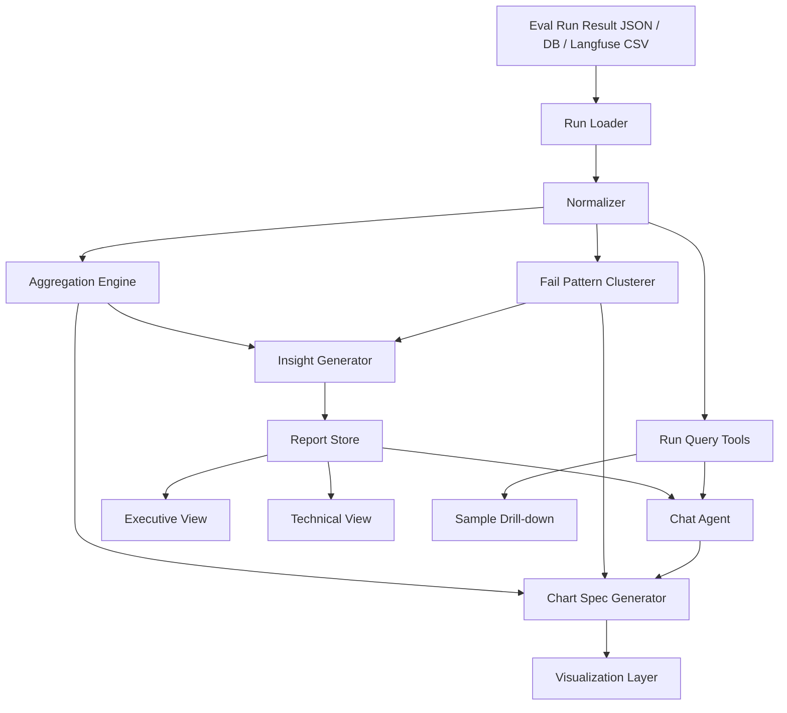

# MVP Spec — Agent Evaluation Summarizer

**Version:** v0.1  
**Owner:** Evaluation Platform team  
**Problem ID:** 8.5 — Agent Evaluation Summarizer  
**Status:** Draft MVP spec  
**Language:** Vietnamese-first UI, English-compatible data schema

---

## 1. Context

VSF đang xây dựng Evaluation Platform để trở thành single source of truth cho chất lượng các sản phẩm AI như V-AI, V-AI Health, V-AI Explorer và các sản phẩm tương lai. Platform xoay quanh các khối chính:

- **Metric-as-Skill:** mỗi metric là một skill có input/output, threshold, phương pháp chấm và khả năng mở rộng.
- **Golden Dataset & Experiment:** chạy eval trước release, so sánh A/B, theo dõi config và kết quả.
- **Production Log:** thu thập request/response, trace, latency, cost, model/prompt version.
- **Production Evaluation:** chạy eval liên tục trên log thật, phát hiện drift/anomaly và alert.

Bài toán 8.5 xuất hiện vì sau mỗi eval run, kết quả thường là nhiều score, fail case, trace và metadata rải rác. PO/AI Ops/dev phải tự đọc dashboard, lọc case, so sánh run và suy luận root cause. Việc này tốn thời gian, dễ bỏ sót pattern và khó quyết định nên fix gì trước.

---

## 2. Product Goal

Xây dựng một **agent chat kèm visualization** có khả năng đọc kết quả eval run, tự sinh report có insight, và cho phép người dùng hỏi đáp đào sâu trên chính run đó.

MVP cần trả lời được 4 câu hỏi chính:

1. **Run này có pass release criteria không?**
2. **Metric/skill nào đang yếu nhất?**
3. **Fail pattern chính là gì, có evidence cụ thể không?**
4. **Nếu chỉ có thời gian fix ít, nên ưu tiên fix gì trước?**

---

## 3. MVP Scope

### 3.1 In scope

MVP tập trung vào **một eval run hiện tại** và **một baseline run tùy chọn**.

Các capability bắt buộc:

1. Import hoặc nhận dữ liệu eval run theo schema chuẩn.
2. Tự sinh report tổng quan khi mở run.
3. Hiển thị chart/table cơ bản:
   - Overall pass rate.
   - Pass rate by metric.
   - Pass rate by skill/product area.
   - Top fail patterns.
   - Regression/improvement so với baseline nếu có.
4. Cluster fail cases theo `error_taxonomy`, `reason`, `metric_name`, `skill_name`.
5. Sinh recommendation theo `impact × effort`.
6. Cho phép chat Q&A trên run hiện tại:
   - “Tại sao metric X tụt?”
   - “Show fail case tệ nhất của skill booking.”
   - “Fix gì trước nếu chỉ có 1 ngày?”
   - “Metric nào kéo overall pass rate xuống nhiều nhất?”
7. Mỗi insight/recommendation phải có evidence:
   - Link/sample id.
   - Metric liên quan.
   - Fail reason.
   - Tối thiểu một fail case minh họa.
8. Có 2 mode hiển thị:
   - **Executive view:** kết luận ngắn, action rõ.
   - **Technical view:** chi tiết metric, fail case, evidence.

### 3.2 Out of scope cho MVP

Không làm trong MVP:

1. Cross-run Q&A nhiều hơn 2 run.
2. Production vs golden coverage gap analysis.
3. Tự động tạo golden dataset mới từ production fail pattern.
4. Alert realtime.
5. Fine-tune/root cause model riêng.
6. Full natural language BI trên toàn bộ data warehouse.
7. Phân quyền phức tạp theo role/team.
8. Auto-create Jira/GitHub ticket.
9. Đánh giá lại metric quality của chính evaluator.

Những phần này để ở post-MVP.

---

## 4. Target Users

### 4.1 PO / AI Ops

Mục tiêu:

- Biết run có đủ điều kiện release không.
- Biết lỗi lớn nhất là gì.
- Có summary đủ ngắn để báo cáo stakeholder.
- Biết nên ưu tiên fix gì.

### 4.2 Dev / ML Engineer

Mục tiêu:

- Drill-down vào metric/skill/tool fail.
- Xem sample cụ thể.
- Đọc lý do fail và evidence.
- Hiểu root cause hypothesis để sửa prompt/tool/schema/model.

### 4.3 Leadership

Mục tiêu:

- Nhìn nhanh chất lượng release.
- So sánh với baseline.
- Biết risk chính và action plan.

---

## 5. MVP User Journey

### Journey A — Open eval run

1. User mở một eval run.
2. System load run metadata, metric results, sample results, fail case.
3. System sinh report tổng quan.
4. UI hiển thị:
   - Release decision: `PASS`, `FAIL`, hoặc `NEEDS_REVIEW`.
   - Overall pass rate.
   - Top regressions.
   - Top fail patterns.
   - Recommended actions.
5. User có thể chuyển giữa Executive / Technical view.

### Journey B — Ask follow-up question

1. User hỏi: “Tại sao `tool_selection_accuracy` fail nhiều?”
2. Agent parse intent.
3. Agent query run data:
   - metric result,
   - skill breakdown,
   - fail case,
   - baseline diff nếu có.
4. Agent trả lời:
   - Summary ngắn.
   - Chart/table nếu phù hợp.
   - Root cause hypothesis.
   - Link fail cases.

### Journey C — Prioritize fixes

1. User hỏi: “Nếu chỉ fix 2 thứ trước release thì fix gì?”
2. Agent tính impact:
   - số fail case bị ảnh hưởng,
   - độ nặng của metric,
   - severity,
   - regression magnitude,
   - release threshold gap.
3. Agent ước lượng effort bằng rule đơn giản:
   - prompt wording/config = low,
   - tool description/schema = medium,
   - model/retrieval/data pipeline = high.
4. Agent trả về danh sách action theo `impact × effort`.

---

## 6. Data Contract

MVP không nên phụ thuộc vào implementation cụ thể của bài 1, 2, 3. Summarizer có một **canonical schema sau normalize** như bên dưới. Raw input có thể là JSON đúng schema, DB record nội bộ, hoặc Langfuse CSV export từ evaluator.

Với file `data_langfuse.csv` hiện tại: dữ liệu **đủ để chạy MVP summarization ở mức sample-level evaluation** gồm score, threshold, judge reasoning, user query, assistant answer, expected output và context. Tuy nhiên raw CSV **chưa đủ giàu** cho một số phần spec đang giả định như `product`, `agent_version`, `prompt_version`, `skill_name`, `error_taxonomy`, `severity` và baseline chính thức. Các field này phải được để `unknown`/`null`, bổ sung qua upload metadata, hoặc được suy luận với nhãn `hypothesis_low_confidence`.

### 6.1 EvalRun

```json
{
  "run_id": "run_2026_05_26_001",
  "run_name": "V-AI Explorer booking eval - prompt v12",
  "run_type": "golden_experiment",
  "product": "v-ai-explorer",
  "agent_version": "agent-v3.2.1",
  "model_version": "gpt-4.1-mini",
  "prompt_version": "booking-router-v12",
  "dataset": {
    "dataset_id": "ds_booking_001",
    "dataset_name": "Booking Golden Dataset",
    "dataset_version": "v5",
    "sample_count": 500
  },
  "started_at": "2026-05-26T09:00:00+07:00",
  "completed_at": "2026-05-26T09:35:00+07:00",
  "baseline_run_id": "run_2026_05_20_001",
  "release_criteria": [
    {
      "metric_name": "tool_selection_accuracy",
      "operator": ">=",
      "threshold": 0.95
    },
    {
      "metric_name": "argument_correctness",
      "operator": ">=",
      "threshold": 0.90
    }
  ]
}
```

### 6.2 MetricResult

```json
{
  "metric_name": "tool_selection_accuracy",
  "metric_group": "tool_calling",
  "score": 0.91,
  "pass_count": 455,
  "fail_count": 45,
  "total_count": 500,
  "threshold": 0.95,
  "status": "FAIL",
  "severity": "high",
  "description": "Whether the agent selected the correct tool inside the chosen skill."
}
```

### 6.3 SampleResult

```json
{
  "sample_id": "sample_0182",
  "trace_id": "trace_abc123",
  "input": {
    "user_input": "Book me a flight from Hanoi to Bangkok next Friday"
  },
  "actual_output": {
    "skill": "travel_planning",
    "tool": "hotel_search",
    "arguments": {
      "city": "Bangkok"
    }
  },
  "expected_output": {
    "skill": "booking",
    "tool": "flight_search",
    "arguments": {
      "from": "Hanoi",
      "to": "Bangkok",
      "date": "2026-05-29"
    }
  },
  "metric_results": [
    {
      "metric_name": "tool_selection_accuracy",
      "score": 0,
      "status": "FAIL",
      "reason": "Agent selected hotel_search instead of flight_search.",
      "error_taxonomy": "wrong_tool_selection",
      "evidence": "User requested a flight but the agent called hotel_search."
    }
  ],
  "metadata": {
    "skill_name": "booking",
    "tool_name": "flight_search",
    "scenario": "flight_booking",
    "language": "en",
    "severity": "high"
  }
}
```

### 6.4 FailPattern

FailPattern là object do summarizer tạo ra sau clustering.

```json
{
  "pattern_id": "pattern_wrong_tool_flight_vs_hotel",
  "title": "Agent confuses flight booking with hotel search",
  "description": "Many booking requests containing destination city are routed to hotel_search even when user asks for flight.",
  "affected_metrics": ["tool_selection_accuracy"],
  "affected_skills": ["booking"],
  "error_taxonomy": "wrong_tool_selection",
  "sample_count": 18,
  "severity": "high",
  "example_sample_ids": ["sample_0182", "sample_0211", "sample_0345"],
  "root_cause_hypothesis": "Tool descriptions for hotel_search and flight_search both emphasize destination city, while flight-specific intent terms are underweighted.",
  "recommended_fix": "Clarify routing rule and tool descriptions for flight intent terms: flight, fly, airport, round trip, one-way."
}
```

### 6.5 Recommendation

```json
{
  "recommendation_id": "rec_001",
  "title": "Separate flight intent from hotel intent in tool descriptions",
  "priority": "P0",
  "impact_score": 0.87,
  "effort_score": 0.25,
  "impact_effort_score": 3.48,
  "why": "This pattern accounts for 18/45 tool_selection_accuracy failures and blocks release threshold.",
  "expected_outcome": "Improve tool_selection_accuracy from 91% toward 95% threshold.",
  "evidence_sample_ids": ["sample_0182", "sample_0211", "sample_0345"],
  "owner_hint": "Prompt/tool schema owner"
}
```

### 6.6 Current evaluator output: Langfuse CSV

Evaluator hiện đang xuất dữ liệu dạng Langfuse CSV, mỗi row là một observation/trace event. Summarizer phải có adapter riêng để đọc format này trước khi normalize sang schema ở 6.1-6.3.

Required CSV columns for MVP:

| Column | Usage |
|---|---|
| `id` | Raw observation id, dùng làm evidence link fallback. |
| `timestamp` | Observation timestamp; dùng để tính `started_at`/`completed_at` theo run. |
| `name` | Chỉ import rows có `dynamic_metric_evaluation:evaluate_sample`. |
| `sessionId` | Chứa `run_id`, `sample_id`, `metric_id` theo pattern bên dưới. |
| `input` | JSON string, chứa `sample.user_query`, `sample.assistant_answer`, `sample.expected_output`, `sample.context`, `sample.conversation`. |
| `output` | JSON string, chứa `score`, `overview_reasoning`, `detail_reasoning`, `llm_step_usage`. |
| `metadata` | JSON string, chứa `metric_id`, `metric_name`, `threshold`, evaluator model/provider và execution metadata. |
| `tags`, `environment`, `comments` | Optional metadata/filtering. |

`sessionId` pattern:

```text
dataset_dm_run:{run_id}:sample:{sample_id}:metric:{metric_id}
```

Rows không match pattern này, hoặc thiếu `input`/`output`/`metadata`, không được đưa vào aggregate chính. Chúng có thể được lưu ở raw log để debug import.

Observed profile của `data_langfuse.csv`:

| Item | Count |
|---|---:|
| Total CSV rows | 197 |
| `dynamic_metric_evaluation:evaluate_sample` rows | 187 |
| Rows match dataset run pattern | 146 |
| Rows có đủ parsed `input` + `output` + `metadata` | 136 |
| Unique eval runs | 4 |
| Unique samples | 77 |
| Unique metrics | 7 |

Adapter mapping:

| Canonical field | Langfuse CSV source |
|---|---|
| `EvalRun.run_id` | `sessionId.dataset_dm_run:{run_id}` |
| `EvalRun.run_name` | `run_name` upload metadata if provided, else `Langfuse run {run_id}` |
| `EvalRun.started_at` / `completed_at` | min/max `timestamp` per `run_id` |
| `MetricResult.metric_name` | `metadata.metric_name` |
| `MetricResult.score` | Average sample score for that metric in the run |
| `MetricResult.threshold` | `metadata.threshold` |
| `MetricResult.pass_count` / `fail_count` | Count sample metric rows by `score >= threshold` |
| `MetricResult.status` | `FAIL` if metric average or any release criterion misses threshold; else `PASS` |
| `SampleResult.sample_id` | `sessionId.sample:{sample_id}` |
| `SampleResult.trace_id` | CSV `id` |
| `SampleResult.input.user_input` | `input.sample.user_query` |
| `SampleResult.actual_output.answer` | `input.sample.assistant_answer` |
| `SampleResult.expected_output.answer` | `input.sample.expected_output` |
| `SampleResult.metadata.context` | `input.sample.context` |
| `SampleResult.metric_results[].score` | `output.score` |
| `SampleResult.metric_results[].reason` | `output.overview_reasoning` |
| `SampleResult.metric_results[].evidence` | `output.detail_reasoning` |
| `SampleResult.metric_results[].error_taxonomy` | Explicit taxonomy if provided; otherwise inferred and marked low confidence |

Fields that should be requested from evaluator/platform in the next iteration:

- `product`, `dataset_id`, `dataset_name`, `dataset_version`.
- `agent_version`, `model_version` of evaluated agent, `prompt_version`.
- Explicit `run_type` and `baseline_run_id`.
- Explicit sample `skill_name`, `scenario`, `language`, `severity`.
- Structured `error_taxonomy` from evaluator or post-processor.
- Stable trace/sample URL if Langfuse UI links are needed.

### 6.7 Normalized input shape from Langfuse CSV

Sau khi normalize, summarizer nên nhận một object duy nhất theo shape:

```json
{
  "run": {
    "run_id": "142f5b73-3333-45e4-9237-24a33d2595f4",
    "run_name": "Langfuse run 142f5b73-3333-45e4-9237-24a33d2595f4",
    "run_type": "langfuse_dataset_run",
    "product": null,
    "agent_version": null,
    "model_version": null,
    "prompt_version": null,
    "dataset": {
      "dataset_id": null,
      "dataset_name": null,
      "dataset_version": null,
      "sample_count": 53
    },
    "started_at": "2026-05-26T07:24:59.189Z",
    "completed_at": "2026-05-26T07:33:02.425Z",
    "baseline_run_id": null,
    "release_criteria": [
      {
        "metric_name": "Plain Clarity",
        "operator": ">=",
        "threshold": 0.9
      }
    ],
    "import_source": "langfuse_csv"
  },
  "metric_results": [
    {
      "metric_name": "Plain Clarity",
      "metric_group": "communication_quality",
      "score": 0.0465,
      "pass_count": 0,
      "fail_count": 53,
      "total_count": 53,
      "threshold": 0.9,
      "status": "FAIL",
      "severity": "high",
      "description": null
    }
  ],
  "sample_results": [
    {
      "sample_id": "79be0842-f1a2-4d5b-8402-8f2fadef3f7b",
      "trace_id": "02ca21aaf4e53ab43ec0d4c63baa3088",
      "input": {
        "user_input": "Tại sao trẻ cần tiêm vắc xin 6 trong 1 ngay từ khi mới sinh?"
      },
      "actual_output": {
        "answer": "Error calling AI Health API: 401 Client Error: Unauthorized..."
      },
      "expected_output": {
        "answer": "Trẻ cần tiêm vắc xin 6 trong 1 ngay từ khi mới sinh vì..."
      },
      "metric_results": [
        {
          "metric_name": "Plain Clarity",
          "score": 0.0,
          "status": "FAIL",
          "threshold": 0.9,
          "reason": "Kết quả bị đánh giá khó hiểu và không đạt vì câu trả lời chỉ là thông báo lỗi 401 Unauthorized...",
          "error_taxonomy": "runtime_or_api_error",
          "taxonomy_confidence": "inferred_low",
          "evidence": "detail_reasoning from evaluator output"
        }
      ],
      "metadata": {
        "context": "",
        "conversation": [],
        "metric_id": "551d08d4-cebc-4ff7-9d41-bb7bca917794",
        "evaluator_model": "gpt-5.2",
        "environment": "default",
        "skill_name": null,
        "severity": "high"
      }
    }
  ],
  "import_warnings": [
    "Missing product/agent/prompt/dataset metadata in CSV.",
    "Missing explicit skill_name and error_taxonomy; taxonomy may be inferred with low confidence.",
    "Rows without dataset_dm_run sessionId or parsed JSON are excluded from aggregate."
  ]
}
```

---

## 7. System Architecture



### 7.1 Components

#### 7.1.1 Run Loader

Input:

- JSON upload.
- Langfuse CSV upload.
- Internal DB query by `run_id`.
- Optional baseline run.
- Optional import metadata override: product, dataset, agent/model/prompt version, baseline run id.

Output:

- Raw run payload.

Responsibilities:

- Validate required fields.
- Check schema version.
- Detect missing metric/sample fields.
- Map existing evaluator output into summarizer schema.
- For Langfuse CSV, parse JSON strings in `input`, `output`, `metadata`.
- For Langfuse CSV, extract `run_id`, `sample_id`, `metric_id` from `sessionId`.
- Exclude non-eval rows from aggregates but keep raw import warnings.

#### 7.1.2 Normalizer

Responsibilities:

- Normalize score format: numeric, boolean, categorical.
- Normalize status: `PASS`, `FAIL`, `WARNING`, `ERROR`, `SKIPPED`.
- Normalize severity.
- Normalize metric group.
- Normalize taxonomy labels.
- Attach sample-level evidence.
- Derive sample metric status from `score >= threshold` when evaluator only emits score.
- Aggregate one row per `(sample_id, metric_name)` into one `SampleResult` with multiple `metric_results`.
- Default missing product/skill/version fields to `null`/`unknown`, not fabricated values.
- Mark inferred taxonomy/root cause as low confidence when not explicitly present in evaluator output.

#### 7.1.3 Aggregation Engine

Computes:

- Overall pass rate.
- Pass rate by metric.
- Pass rate by skill.
- Fail count by taxonomy.
- Threshold gap.
- Regression/improvement vs baseline.
- Top affected product areas.
- Distribution by severity.
- Top N worst samples.

#### 7.1.4 Fail Pattern Clusterer

MVP approach:

1. Rule-based grouping first:
   - `metric_name`
   - `error_taxonomy`
   - `skill_name`
   - similar `reason`
2. Optional embedding clustering for similar fail reasons.
3. LLM naming/summarization for each cluster.

The clusterer should not invent evidence. It can name and summarize a cluster only from existing fail cases.

#### 7.1.5 Insight Generator

Generates:

- Executive summary.
- Technical analysis.
- Root cause hypotheses.
- Recommended actions.
- Release decision explanation.

Important guardrail:

- Every insight must cite evidence sample IDs.
- If evidence is weak, mark as `hypothesis_low_confidence`.

#### 7.1.6 Chat Agent

The chat agent should not answer from memory only. It must use tools over run data.

MVP tools:

```ts
get_run_overview(run_id)
get_metric_breakdown(run_id, metric_name?)
get_skill_breakdown(run_id, skill_name?)
get_fail_patterns(run_id, filters?)
search_fail_cases(run_id, filters, limit)
get_sample_detail(sample_id)
compare_with_baseline(run_id, baseline_run_id)
generate_chart_spec(query_result, chart_type?)
```

#### 7.1.7 Visualization Layer

MVP chart types:

- Bar chart: pass rate by metric.
- Bar chart: fail count by taxonomy.
- Table: top fail patterns.
- Table: recommended actions.
- Delta table: current vs baseline.
- Heatmap optional: metric × skill.

Chart output should be generated as declarative `ChartSpec`, not hard-coded natural language.

---

## 8. Report Structure

### 8.1 Executive View

Template:

```md
# Evaluation Run Summary

## Release Decision
{PASS | FAIL | NEEDS_REVIEW}

## Key Numbers
- Overall pass rate: {x}%
- Failed metrics: {n}
- Biggest regression: {metric} ({delta}%)
- Highest-risk skill: {skill}

## Main Findings
1. {finding_1}
2. {finding_2}
3. {finding_3}

## Recommended Actions
1. {P0 action} — impact: {high}, effort: {low/medium/high}
2. {P1 action}
3. {P2 action}

## Evidence
- {sample links}
```

### 8.2 Technical View

Template:

```md
# Technical Evaluation Analysis

## Metric Breakdown
| Metric | Score | Threshold | Status | Delta vs Baseline |
|---|---:|---:|---|---:|

## Skill Breakdown
| Skill | Pass Rate | Fail Count | Top Error |
|---|---:|---:|---|

## Top Fail Patterns
| Pattern | Count | Severity | Affected Metric | Evidence |
|---|---:|---|---|---|

## Root Cause Hypotheses
### Hypothesis 1
- Evidence:
- Why this matters:
- How to validate:
- Suggested fix:

## Sample Drill-down
- sample_id:
- input:
- expected:
- actual:
- metric failure:
- judge reason:
```

---

## 9. Chat Q&A Requirements

### 9.1 Supported question types in MVP

| User question | Required behavior |
|---|---|
| “Run này pass không?” | Explain release status using criteria and failed metrics. |
| “Metric nào fail nhiều nhất?” | Return sorted metric breakdown and chart. |
| “Skill nào tệ nhất?” | Return skill breakdown by pass rate/fail count. |
| “Tại sao metric X tụt?” | Compare current vs baseline, show fail pattern and examples. |
| “Show 10 fail case tệ nhất” | Return fail cases sorted by severity/impact. |
| “Fix gì trước?” | Return prioritized recommendations with evidence. |
| “Có regression không?” | Compare metric deltas with baseline. |
| “Có pattern nào mới không?” | If baseline exists, show fail patterns present/increased in current run. |

### 9.2 Response rule

Every answer should follow:

```text
Answer summary
→ Supporting numbers
→ Evidence sample IDs
→ Recommended next step
→ Chart/table if useful
```

### 9.3 Refusal / uncertainty behavior

If data is missing:

- Say what is missing.
- Do not fabricate.
- Suggest what field/log is needed.

Example:

```text
Mình chưa thể kết luận root cause vì run này không có sample-level reason/evidence. 
Mình chỉ thấy metric argument_correctness giảm từ 94% xuống 88%. 
Để diagnose sâu hơn cần thêm expected_arguments, actual_arguments và judge_reason ở từng sample.
```

---

## 10. Insight Generation Logic

### 10.1 Release decision

```text
IF any release criterion status = FAIL
  release_decision = FAIL
ELSE IF missing critical metric OR high severity unknowns exist
  release_decision = NEEDS_REVIEW
ELSE
  release_decision = PASS
```

### 10.2 Impact score

Suggested formula:

```text
impact_score =
  0.40 * normalized_fail_count
+ 0.25 * severity_weight
+ 0.20 * threshold_gap
+ 0.15 * regression_delta
```

Where:

- `normalized_fail_count = fail_count / total_fail_count`
- `severity_weight`: low = 0.3, medium = 0.6, high = 0.85, critical = 1.0
- `threshold_gap = max(0, threshold - score)`
- `regression_delta = max(0, baseline_score - current_score)`

### 10.3 Effort score

MVP rule-based estimate:

| Signal | Effort |
|---|---|
| Prompt wording issue | Low |
| Tool description ambiguity | Low-Medium |
| Argument schema validation issue | Medium |
| Missing expected data / dataset issue | Medium |
| Retrieval/data source issue | High |
| Model capability limitation | High |
| Multimodal parsing issue | High |

### 10.4 Priority

```text
priority_score = impact_score / max(effort_score, 0.1)
```

Priority label:

- P0: release-blocking or critical safety issue.
- P1: high-impact quality issue.
- P2: useful improvement.
- P3: low impact / cleanup.

---

## 11. LLM Prompts

### 11.1 System prompt for Report Generator

```text
You are an Evaluation Run Analyst for an AI Evaluation Platform.

Your job:
- Read structured evaluation results.
- Summarize the run for PO, AI Ops, and engineers.
- Identify top fail patterns.
- Compare against baseline when provided.
- Recommend fixes based on impact × effort.

Rules:
- Never invent metrics, samples, or causes.
- Every finding must cite sample IDs or aggregate numbers.
- Separate facts from hypotheses.
- If evidence is weak, label the hypothesis as low confidence.
- Prefer concrete fixes over generic advice.
- Output both executive and technical summaries.
```

### 11.2 User prompt for Report Generator

```text
Given this eval run:
{run_json}

Optional baseline:
{baseline_json}

Generate:
1. Release decision.
2. Executive summary.
3. Metric breakdown.
4. Top fail patterns.
5. Root cause hypotheses.
6. Prioritized recommendations.
7. Evidence sample IDs for each finding.
8. Suggested charts.
```

### 11.3 System prompt for Chat Agent

```text
You are an interactive evaluation summarizer.

You answer questions about one evaluation run at a time.
Use available tools to query run statistics, fail cases, sample details and baseline comparison.

Rules:
- Do not answer from memory if the answer requires run data.
- Use sample IDs as evidence.
- If the user asks for visualization, return a chart spec.
- If the data does not support a conclusion, say so clearly.
- Keep executive answers short; provide technical detail when asked.
```

---

## 12. API Design

### 12.1 Upload run

Canonical JSON import:

```http
POST /api/eval-runs/import
Content-Type: application/json
```

Request:

```json
{
  "run": {},
  "baseline_run": {}
}
```

Langfuse CSV import:

```http
POST /api/eval-runs/import
Content-Type: multipart/form-data
```

Request fields:

| Field | Required | Description |
|---|---|---|
| `file` | yes | Langfuse CSV export. |
| `format` | yes | `langfuse_csv`. |
| `run_id` | no | If provided, import only one run from a CSV containing multiple runs. |
| `baseline_run_id` | no | Optional baseline run id for comparison. |
| `metadata` | no | JSON override for product, dataset, agent/model/prompt version, release criteria. |

Response:

```json
{
  "run_id": "run_2026_05_26_001",
  "status": "imported",
  "imported_rows": 136,
  "excluded_rows": 61,
  "validation_warnings": []
}
```

### 12.2 Generate report

```http
POST /api/eval-runs/{run_id}/summary
```

Response:

```json
{
  "run_id": "run_2026_05_26_001",
  "release_decision": "FAIL",
  "executive_summary": "...",
  "technical_summary": "...",
  "charts": [],
  "fail_patterns": [],
  "recommendations": []
}
```

### 12.3 Ask question

```http
POST /api/eval-runs/{run_id}/chat
```

Request:

```json
{
  "message": "Tại sao tool_selection_accuracy tụt?",
  "view_mode": "technical"
}
```

Response:

```json
{
  "answer": "...",
  "charts": [],
  "tables": [],
  "evidence_sample_ids": ["sample_0182"]
}
```

### 12.4 Get sample detail

```http
GET /api/eval-runs/{run_id}/samples/{sample_id}
```

---

## 13. UI Spec

### 13.1 Page layout

```text
[Run Header]
- run name
- product
- run type
- agent/model/prompt version
- dataset version
- baseline selector

[Release Decision Card]
- PASS / FAIL / NEEDS_REVIEW
- reason
- failed criteria

[Tabs]
1. Executive Summary
2. Technical Analysis
3. Fail Patterns
4. Samples
5. Chat
```

### 13.2 Executive Summary tab

Cards:

- Overall pass rate.
- Failed metrics.
- Biggest regression.
- Highest-risk skill.
- Recommended P0 action.

Charts:

- Pass rate by metric.
- Fail count by taxonomy.

### 13.3 Technical Analysis tab

Tables:

- Metric breakdown.
- Skill breakdown.
- Baseline comparison.
- Threshold gap.

### 13.4 Fail Patterns tab

Each pattern card:

- Pattern title.
- Count.
- Severity.
- Affected metrics/skills.
- Root cause hypothesis.
- Recommended fix.
- Evidence sample links.

### 13.5 Samples tab

Filter by:

- Metric.
- Skill.
- Taxonomy.
- Severity.
- Status.
- Search text.

Columns:

- sample_id.
- input preview.
- expected preview.
- actual preview.
- failed metric.
- reason.
- evidence.

### 13.6 Chat tab

Left:

- conversation.

Right:

- dynamic chart/table panel.
- pinned evidence samples.

Suggested starter questions:

- “Run này pass không?”
- “Metric nào fail nhiều nhất?”
- “Skill nào đang có risk cao nhất?”
- “Show 10 fail case tệ nhất.”
- “Fix gì trước nếu chỉ có 1 ngày?”

---

## 14. Storage Model

### 14.1 Tables

#### eval_runs

| Column | Type |
|---|---|
| id | string |
| name | string |
| run_type | string |
| product | string |
| agent_version | string |
| model_version | string |
| prompt_version | string |
| dataset_id | string |
| dataset_version | string |
| baseline_run_id | string nullable |
| started_at | datetime |
| completed_at | datetime |
| import_source | string |
| import_warnings_json | json |
| raw_payload_uri | string |

#### metric_results

| Column | Type |
|---|---|
| id | string |
| run_id | string |
| metric_name | string |
| metric_group | string |
| score | float |
| pass_count | int |
| fail_count | int |
| total_count | int |
| threshold | float |
| status | string |
| severity | string |

#### sample_results

| Column | Type |
|---|---|
| id | string |
| run_id | string |
| sample_id | string |
| trace_id | string |
| raw_observation_id | string nullable |
| input_json | json |
| expected_json | json |
| actual_json | json |
| metadata_json | json |

#### sample_metric_results

| Column | Type |
|---|---|
| id | string |
| sample_result_id | string |
| metric_name | string |
| score | float |
| threshold | float |
| status | string |
| reason | text |
| error_taxonomy | string |
| taxonomy_confidence | string |
| evidence | text |
| severity | string |

#### fail_patterns

| Column | Type |
|---|---|
| id | string |
| run_id | string |
| title | string |
| description | text |
| affected_metrics | json |
| affected_skills | json |
| error_taxonomy | string |
| sample_count | int |
| severity | string |
| example_sample_ids | json |
| root_cause_hypothesis | text |
| recommended_fix | text |
| confidence | float |

#### recommendations

| Column | Type |
|---|---|
| id | string |
| run_id | string |
| title | string |
| priority | string |
| impact_score | float |
| effort_score | float |
| impact_effort_score | float |
| why | text |
| expected_outcome | text |
| evidence_sample_ids | json |
| owner_hint | string |

---

## 15. MVP Acceptance Criteria

### Functional

- User can import one eval run JSON.
- User can optionally attach one baseline run.
- System generates executive and technical summary.
- System shows pass rate by metric and skill.
- System lists top fail patterns with evidence.
- System recommends prioritized fixes.
- User can ask supported Q&A questions over the run.
- User can click a fail case and see input/expected/actual/reason/evidence.

### Quality

- No generated insight without evidence.
- Each recommendation has at least one supporting metric and one sample/example.
- If baseline is absent, system does not claim regression.
- If sample-level reason is absent, system says root cause confidence is low.
- The same run input should produce stable aggregate numbers.

### UX

- First screen answers: “pass or fail?”, “why?”, “what to fix first?”
- Technical user can drill from aggregate chart → pattern → sample.
- Executive user can copy a short summary into status update.

---

## 16. Suggested Demo Scenario

Use a mock run from Skill & Tool Calling Evaluator.

### Dataset

- 100 samples.
- 3 metrics:
  - `skill_selection_accuracy`
  - `tool_selection_accuracy`
  - `argument_correctness`
- 4 skills:
  - `booking`
  - `travel_planning`
  - `medical_lookup`
  - `general_qa`

### Injected failure patterns

1. Flight booking requests routed to hotel search.
2. Missing required `date` argument.
3. Medical lookup skill selected for general health advice.
4. Date argument has wrong format.

### Demo flow

1. Open run.
2. Show release decision: FAIL.
3. Show `tool_selection_accuracy` below threshold.
4. Ask chat: “Tại sao tool_selection_accuracy fail?”
5. Agent shows pattern: flight vs hotel confusion.
6. Click sample.
7. Ask: “Fix gì trước?”
8. Agent recommends clarifying tool descriptions and adding routing examples.

---

## 17. Team Split for 2 People

### Person A — Backend / Agent

- Data contract and normalization.
- Aggregation engine.
- Fail pattern clustering.
- Report generation prompt.
- Chat tools.
- API endpoints.

### Person B — Frontend / Product UX

- Run overview page.
- Charts/tables.
- Fail pattern cards.
- Sample drill-down.
- Chat UI.
- Demo data and flow polish.

Shared:

- Define mock data.
- Define taxonomy.
- Test generated insights.
- Prepare final demo/storyline.

---

## 18. Risk & Mitigation

| Risk | Why it matters | Mitigation |
|---|---|---|
| Summarizer gives generic advice | Makes product feel shallow | Require evidence sample IDs and concrete recommended fix. |
| LLM hallucinates root cause | Dangerous for release decisions | Separate fact vs hypothesis; confidence labels; evidence required. |
| Metric schemas vary across evaluators | Summarizer may break | Use generic schema + normalizer + schema versioning. |
| Fail clustering is noisy | Wrong pattern diagnosis | Start rule-based, then add embedding/LLM naming. |
| UI becomes just another dashboard | Misses agent value | Make chat Q&A and action recommendation central. |
| Baseline missing | Cannot detect regression | Report current run only; clearly say no baseline comparison. |
| Too much scope | Team 2 người dễ quá tải | Keep MVP to one run + optional baseline; cross-run later. |

---

## 19. Post-MVP Roadmap

### Phase 2

- Cross-run Q&A across last N runs.
- Trend analysis over time.
- Production log anomaly mode.
- Compare agent versions.
- More advanced pattern clustering with embeddings.
- Human feedback on recommendations.

### Phase 3

- Production vs golden coverage gap:
  - Detect production fail pattern not covered by golden dataset.
  - Suggest new golden samples.
- Auto-create issue/ticket.
- Scheduled weekly evaluation digest.
- Role-based report view.
- Alerting when regression exceeds threshold.

### Phase 4

- Meta-evaluation of summarizer:
  - Human rating on usefulness.
  - Precision of root cause hypotheses.
  - Recommendation acceptance rate.
  - False-positive/false-negative insight tracking.

---

## 20. Research & Reference Reading

### Evaluation platforms and workflows

1. **LangSmith Evaluation documentation**  
   Useful for offline/online evaluation workflow: dataset → evaluator → experiment → analysis.  
   https://docs.langchain.com/langsmith/evaluation

2. **Langfuse Scores Data Model**  
   Useful for designing score objects, score configs, trace/session/dataset-run level scores.  
   https://langfuse.com/docs/evaluation/scores/data-model

3. **Langfuse Experiments via SDK**  
   Useful for understanding item-level evaluators and run-level evaluators.  
   https://langfuse.com/docs/evaluation/experiments/experiments-via-sdk

4. **DeepEval metrics introduction**  
   Useful for seeing how existing tools categorize RAG, agentic, multi-turn, safety and custom metrics.  
   https://deepeval.com/docs/metrics-introduction

5. **Ragas metrics**  
   Useful reference for metric design and systematic evaluation loops for LLM apps.  
   https://docs.ragas.io/en/stable/concepts/metrics/

### LLM-as-a-Judge research

6. **G-Eval: NLG Evaluation using GPT-4 with Better Human Alignment**  
   Useful for LLM-based evaluator design, form-filling evaluation and human-alignment discussion.  
   https://arxiv.org/abs/2303.16634

7. **Judging LLM-as-a-Judge with MT-Bench and Chatbot Arena**  
   Useful for LLM judge limitations: position bias, verbosity bias, self-enhancement bias, limited reasoning.  
   https://arxiv.org/abs/2306.05685

8. **A Survey on LLM-as-a-Judge**  
   Useful overview for reliability, bias mitigation and judge design patterns.  
   https://arxiv.org/abs/2411.15594

---

## 21. Final MVP Definition

A successful MVP is not a “pretty report generator”. It must be an **actionable evaluation analyst**:

- It reads one run.
- It explains pass/fail.
- It finds the biggest failure patterns.
- It supports Q&A over the run.
- It links every claim to evidence.
- It tells the team what to fix first.

The strongest demo is:

```text
Before: PO sees 500 rows of eval results and many charts.
After: PO opens one report and immediately knows:
- release should fail,
- tool_selection_accuracy is the blocker,
- 18 fail cases come from flight/hotel confusion,
- fixing tool descriptions is the highest impact low-effort action,
- here are the sample links proving it.
```
